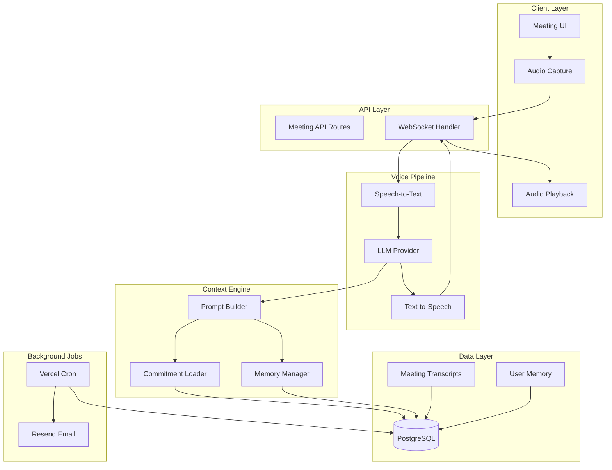
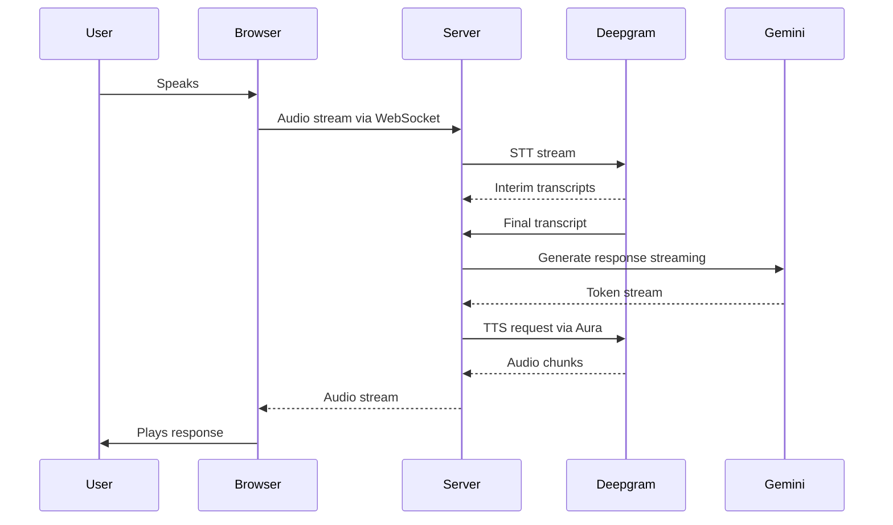
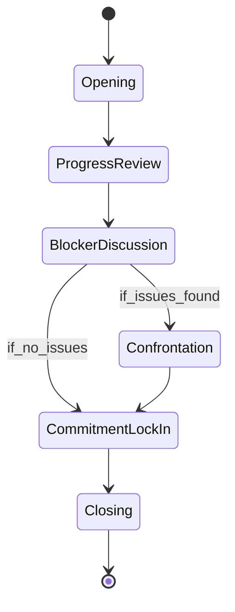

# AI Manager Meeting - Complete Implementation Plan

## Architecture Overview



---

## 1. Database Schema Extensions

Add new models to [`prisma/schema.prisma`](prisma/schema.prisma):

```prisma
model Meeting {
  id            String   @id @default(cuid())
  userId        String
  user          User     @relation(fields: [userId], references: [id], onDelete: Cascade)
  startedAt     DateTime @default(now())
  endedAt       DateTime?
  status        MeetingStatus @default(IN_PROGRESS)
  transcript    Json?    // Array of {role, content, timestamp}
  summary       String?
  observations  Json?    // {patterns: [], risks: [], improvements: []}
  
  @@index([userId])
  @@map("meetings")
}

model UserMemory {
  id          String   @id @default(cuid())
  userId      String
  user        User     @relation(fields: [userId], references: [id], onDelete: Cascade)
  category    MemoryCategory
  content     String
  importance  Int      @default(5)  // 1-10 scale
  sourceId    String?  // Reference to meeting ID
  createdAt   DateTime @default(now())
  expiresAt   DateTime?
  
  @@index([userId, category])
  @@map("user_memories")
}

enum MeetingStatus {
  SCHEDULED
  IN_PROGRESS
  COMPLETED
  MISSED
  CANCELLED
}

enum MemoryCategory {
  MISSED_COMMITMENT
  EXCUSE_PATTERN
  DELAY_PATTERN
  POSITIVE_TREND
  WORK_STYLE
  BLOCKER
}
```

---

## 2. Meeting UI/UX

### File Structure

```
app/(protected)/meeting/
  - page.tsx              # Meeting room UI
  - layout.tsx            # Meeting-specific layout (no sidebar)
components/meeting/
  - MeetingRoom.tsx       # Main meeting container
  - MeetingControls.tsx   # Mute, end, etc.
  - TranscriptPanel.tsx   # Live transcript display
  - MeetingTimer.tsx      # Duration tracker
  - AudioVisualizer.tsx   # Voice activity indicator
  - MeetingStates.tsx     # Pre/post meeting screens
```

### Meeting States

| State | Description | UI |

|-------|-------------|-----|

| `READY` | Meeting can start | "Join Meeting" button, agenda preview |

| `CONNECTING` | Establishing connection | Loading animation, "Connecting..." |

| `IN_PROGRESS` | Active meeting | Timer, transcript, visualizer, controls |

| `AI_SPEAKING` | AI is talking | Animated AI indicator, muted user input |

| `USER_SPEAKING` | User is talking | Voice visualizer active |

| `PROCESSING` | AI thinking | Subtle loading state |

| `ENDING` | Meeting concluding | Summary generation indicator |

| `COMPLETED` | Meeting finished | Summary view, next actions |

### Key UI Principles

- Dark, focused UI (meeting room aesthetic)
- Central AI presence indicator (not avatar, abstract waveform)
- Minimal controls: End Meeting, Mute (optional)
- Live transcript for accessibility
- No chat input - voice only

---

## 3. Voice Pipeline Architecture (Real-Time Focus)

### Technology Choices

| Component | Provider | Rationale |

|-----------|----------|-----------|

| Speech-to-Text | **Deepgram Nova-2** | Real-time streaming, <300ms latency, excellent accuracy |

| LLM | **Google Gemini 1.5 Flash** | Generous free tier, fast inference (~500ms), good reasoning |

| Text-to-Speech | **Deepgram Aura** | Same provider as STT (simplified), low latency streaming |

### Why Single Provider for Voice (Deepgram)

- **Reduced latency**: No cross-provider network hops
- **Simplified auth**: Single API key for STT + TTS
- **Consistent quality**: Aura voices are optimized for conversational AI
- **Cost efficiency**: Combined billing, generous free tier

### Real-Time Latency Budget (Target: <1.5s round-trip)

| Stage | Target | Notes |

|-------|--------|-------|

| Audio capture to STT | 300ms | Streaming, interim results |

| STT to Gemini | 100ms | Network + parsing |

| Gemini processing | 500-800ms | Flash model, streaming output |

| TTS generation | 200-300ms | Deepgram Aura streaming |

| Audio playback start | 100ms | Buffer + decode |

| **Total round-trip** | **~1.2-1.6s** | Feels conversational |

### Voice Pipeline Flow



### File Structure

```
lib/voice/
  - deepgram.ts      # Deepgram client (STT + TTS)
  - stt.ts           # STT wrapper with streaming
  - tts.ts           # TTS wrapper with Aura voices
  - pipeline.ts      # Real-time orchestration
  - vad.ts           # Voice Activity Detection
lib/ai/
  - gemini.ts        # Google Gemini client
  - meeting-agent.ts # Meeting-specific logic
```

### Gemini Integration

```typescript
import { GoogleGenerativeAI } from "@google/generative-ai";

const genAI = new GoogleGenerativeAI(process.env.GOOGLE_AI_API_KEY!);
const model = genAI.getGenerativeModel({ 
  model: "gemini-1.5-flash",
  generationConfig: {
    maxOutputTokens: 150,  // Keep responses concise for voice
    temperature: 0.7,
  }
});
```

---

## 4. AI Meeting Logic (Core)

### Meeting Phases



**Meeting Duration: 3-5 minutes (hard cap at 5 min)**

| Phase | Duration | AI Behavior |

|-------|----------|-------------|

| **Opening** | 15-20s | Brief greeting, state purpose, one-line reference to last meeting |

| **Progress Review** | 1-2min | Quick status on top 3 priorities only, yes/no then probe |

| **Blocker Discussion** | 45s-1min | One focused "why" question per incomplete item |

| **Confrontation** | 30s-1min | Only if patterns detected. Single pointed reference |

| **Commitment Lock-In** | 45s-1min | One clear commitment with deadline |

| **Closing** | 15-20s | Recap commitment, end firmly |

**Pacing Rules:**

- AI responses: 2-3 sentences max (keeps TTS fast)
- No rambling - if user goes off-topic, redirect immediately
- Skip Confrontation phase if no patterns (saves ~1 min)
- Hard cutoff at 5 min with forced closing

### AI Behavioral Rules

**MUST DO:**

- Lead the conversation, never wait passively
- Reject vague answers ("I'll try" → "What specifically will you do?")
- Reference specific commitments by name
- Escalate tone when patterns repeat (tracked via memory)
- End every meeting with explicit commitments

**MUST NOT:**

- Engage in casual conversation
- Accept excuses without follow-up questions
- Let user control the agenda
- Give motivational speeches
- Be apologetic about asking hard questions

### Conversation Control Logic

```
lib/ai/
  - meeting-agent.ts     # Main agent orchestration
  - phases/
    - opening.ts         # Opening phase prompts
    - review.ts          # Progress review logic
    - blockers.ts        # Blocker probing
    - confrontation.ts   # Pattern-based escalation
    - commitment.ts      # Lock-in phase
    - closing.ts         # Meeting conclusion
  - rules.ts             # Behavioral rules and guardrails
```

---

## 5. Context Injection System

### Data Fetched Before Meeting

1. **Active Commitments** - All ACTIVE goals (daily/weekly/monthly)
2. **Recently Completed** - Last 7 days of completions
3. **Commitment History** - Status changes, time since creation
4. **Previous Meeting** - Summary and observations from last meeting
5. **User Memory** - Relevant patterns and behaviors

### Context Builder (`lib/context/builder.ts`)

```typescript
interface MeetingContext {
  user: { name: string; memberSince: Date };
  activeCommitments: CommitmentContext[];
  recentCompletions: CompletionContext[];
  lastMeeting: MeetingSummary | null;
  memories: MemoryItem[];
  currentPhase: MeetingPhase;
}
```

### Token Management

- Context window budget: ~4000 tokens for context
- Prioritize by: recency, importance, relevance to current phase
- Summarize older meetings (not full transcripts)

---

## 6. Persistent Memory System

### What Gets Stored

| Category | Example | Importance | TTL |

|----------|---------|------------|-----|

| `MISSED_COMMITMENT` | "Missed 'Exercise daily' 3 times in 2 weeks" | 8 | 30 days |

| `EXCUSE_PATTERN` | "Frequently cites 'too busy' for incomplete work" | 7 | 60 days |

| `DELAY_PATTERN` | "Consistently overestimates completion time by 2x" | 6 | 90 days |

| `POSITIVE_TREND` | "Completed all daily goals for 5 consecutive days" | 5 | 14 days |

| `WORK_STYLE` | "Works better with morning deadlines" | 4 | 180 days |

| `BLOCKER` | "Reports energy issues in afternoon meetings" | 5 | 30 days |

### Memory Lifecycle

1. **Extraction**: After each meeting, AI extracts key observations
2. **Deduplication**: Similar memories are merged, importance increased
3. **Injection**: Relevant memories injected based on phase and topic
4. **Decay**: Memories expire or importance decreases over time

### File Structure

```
lib/memory/
  - extractor.ts      # Extract memories from meeting
  - manager.ts        # CRUD operations
  - selector.ts       # Select relevant memories for context
  - summarizer.ts     # Compress old memories
```

---

## 7. Meeting Output

### Post-Meeting Generation

After meeting ends:

1. **Summary**: 3-5 sentence meeting recap
2. **Observations**: Patterns, risks, improvements
3. **Updated Commitments**: New/modified goals
4. **Memories**: Extracted behavioral patterns

### Output Schema

```typescript
interface MeetingOutput {
  summary: string;
  observations: {
    patterns: string[];    // Behavioral patterns noticed
    risks: string[];       // Potential issues flagged
    improvements: string[]; // Positive changes
  };
  commitments: {
    new: Commitment[];
    updated: CommitmentUpdate[];
  };
  memories: MemoryItem[];
}
```

### User-Facing Summary

- Displayed immediately after meeting
- Stored in Meeting record
- Accessible from dashboard history

---

## 8. Meeting Reminders (Email)

### Implementation

- **Provider**: Resend
- **Template**: React Email components
- **Trigger**: Vercel Cron (every minute, check for meetings in next 15 min)

### File Structure

```
app/api/cron/
  - meeting-reminders/route.ts   # Cron endpoint
lib/email/
  - client.ts                    # Resend client
  - templates/
    - meeting-reminder.tsx       # React Email template
```

### Email Content

- Subject: "Your accountability check-in starts in 15 minutes"
- Body: Meeting time, direct join link, 1-2 top commitments preview
- Tone: Professional, no motivational language
- CTA: "Join Meeting" button

### Cron Logic

```
1. Query MeetingSchedules where nextMeeting is 15 min from now
2. Filter: isActive = true, not already reminded today
3. Send email via Resend
4. Mark reminder sent (prevent duplicates)
```

### Missed Meeting Handling

- If user doesn't join within 10 min of scheduled time
- Mark meeting as MISSED
- Store as memory (MISSED_COMMITMENT category)
- Reference in next meeting opening

---

## 9. API Routes

```
app/api/
  meeting/
    - route.ts              # POST: Start meeting, GET: Current meeting
    - [id]/route.ts         # GET: Meeting details, PATCH: Update
    - [id]/end/route.ts     # POST: End meeting, generate summary
  voice/
    - ws/route.ts           # WebSocket for real-time audio
    - stt/route.ts          # STT API (if not using WS)
    - tts/route.ts          # TTS API (if not using WS)
  memory/
    - route.ts              # GET: User memories
  cron/
    - meeting-reminders/route.ts
```

---

## 10. Environment Variables

```env
# Voice Pipeline (Deepgram - STT + TTS)
DEEPGRAM_API_KEY=
DEEPGRAM_TTS_VOICE=aura-asteria-en  # Options: aura-asteria-en, aura-luna-en, aura-stella-en

# LLM (Google Gemini)
GOOGLE_AI_API_KEY=

# Email (Resend)
RESEND_API_KEY=
RESEND_FROM_EMAIL=meetings@yourdomain.com

# App
NEXT_PUBLIC_APP_URL=http://localhost:3000

# Meeting Config
MEETING_MAX_DURATION_MS=300000  # 5 minutes
MEETING_REMINDER_MINUTES=15
```

### API Key Setup

| Service | Free Tier | Link |

|---------|-----------|------|

| Deepgram | $200 credit | https://console.deepgram.com |

| Google AI | 1M tokens/month free | https://aistudio.google.com |

| Resend | 3000 emails/month | https://resend.com |

---

## Implementation Order

| Phase | Tasks | Estimated Effort |

|-------|-------|------------------|

| **Phase 1** | Database schema, Meeting model, basic API routes | 1-2 days |

| **Phase 2** | Meeting UI shell, states, controls, timer | 2-3 days |

| **Phase 3** | Deepgram integration (STT + TTS Aura), WebSocket | 3-4 days |

| **Phase 4** | Gemini integration, basic conversation flow | 2 days |

| **Phase 5** | Meeting phases, behavioral rules, context injection | 3-4 days |

| **Phase 6** | Memory system, extraction, injection | 2-3 days |

| **Phase 7** | Meeting output, summaries, observations | 1-2 days |

| **Phase 8** | Email reminders, Vercel Cron setup | 1 day |

| **Phase 9** | Real-time polish, latency optimization, testing | 2-3 days |

**Total Estimated Time: 2.5-3 weeks**

---

## 11. Real-Time Optimizations

### Client-Side

```typescript
// Audio capture with optimal settings for voice
const mediaRecorder = new MediaRecorder(stream, {
  mimeType: 'audio/webm;codecs=opus',
  audioBitsPerSecond: 16000,  // Voice doesn't need high bitrate
});

// Small chunks for lower latency
mediaRecorder.start(100);  // 100ms chunks
```

### Server-Side

- **WebSocket keep-alive**: Maintain persistent connection during meeting
- **Streaming throughout**: Never wait for full response before sending next stage
- **Pre-warm connections**: Connect to Deepgram/Gemini when user clicks "Join"
- **Sentence-level TTS**: Start speaking first sentence while generating rest

### Interruption Handling

When user starts speaking while AI is talking:

1. Immediately stop TTS playback
2. Cancel pending TTS requests
3. Begin STT on user audio
4. Queue user input for next AI response

### Connection Recovery

```typescript
// Auto-reconnect WebSocket with exponential backoff
const reconnect = (attempt = 0) => {
  const delay = Math.min(1000 * Math.pow(2, attempt), 10000);
  setTimeout(() => connectWebSocket(), delay);
};
```

---

## Key Risks and Mitigations

| Risk | Impact | Mitigation |

|------|--------|------------|

| Voice latency >2s | Poor UX, feels laggy | Use streaming everywhere, sentence-level TTS, pre-warm connections |

| Gemini rate limits | Meeting fails mid-conversation | Monitor usage, implement backoff, cache common responses |

| AI goes off-script | Loss of authority | Strong system prompts, phase state machine, max token limits |

| Deepgram connection drops | Audio stops | WebSocket reconnect logic, graceful degradation to text |

| Context overflow | Degraded AI performance | 3-commitment focus, aggressive summarization |

| User talks too long | Meeting exceeds 5 min | Polite interruption after 30s, hard cutoff timer |

| Cron timing drift | Missed reminders | Buffer window (14-16 min), idempotent sends |

---

## Assumptions

1. Users have microphone access and grant permissions
2. **Meetings are 3-5 minutes max** (5 min hard cap)
3. Single user per meeting (no multi-party)
4. English language only for MVP
5. Desktop/mobile web (no native app)
6. Stable internet connection (real-time streaming required)
7. Modern browser with WebSocket and MediaRecorder API support