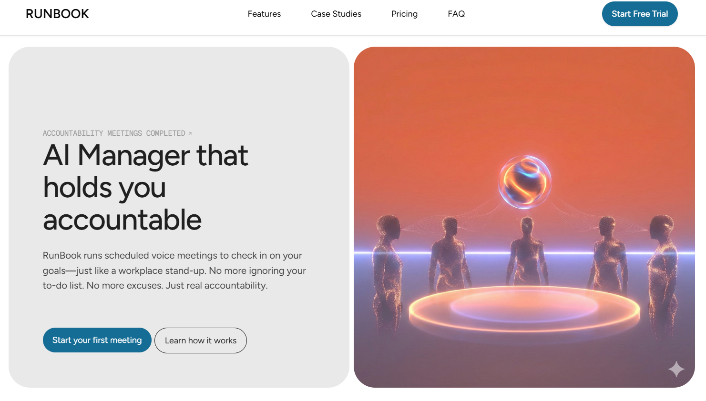

# RunBook - AI Accountability Manager

An AI manager that runs scheduled voice meetings to hold users accountable for their goals—just like a workplace stand-up.



## What is RunBook?

RunBook is an AI Accountability Manager that replaces self-discipline with structure. Instead of passive todo apps, users attend scheduled voice meetings with an AI manager who:

- Knows their goals
- Remembers past commitments
- Questions incomplete work
- Identifies behavioral patterns
- Locks in new commitments

The AI has authority: it doesn't wait for you to act, it shows up and expects results.

## Key Features

- **Voice Meetings**: Scheduled voice calls (not chat) for real accountability
- **Goal Tracking**: Set and track daily, weekly, or monthly goals
- **Long-term Memory**: AI remembers missed deadlines, excuses, and patterns
- **Pattern Recognition**: Identifies repeated behaviors and over-commitment
- **Meeting Summaries**: Get summaries and progress notes after each meeting

## Tech Stack

- [Next.js](https://nextjs.org) - React framework
- [TypeScript](https://www.typescriptlang.org) - Type safety
- [Tailwind CSS](https://tailwindcss.com) - Styling
- [Framer Motion](https://www.framer.com/motion/) - Animations

## Getting Started

First, install dependencies:

```bash
npm install
# or
yarn install
# or
pnpm install
```

Then, run the development server:

```bash
npm run dev
# or
yarn dev
# or
pnpm dev
```

Open [http://localhost:3000](http://localhost:3000) with your browser to see the landing page.

## Project Structure

- `/components` - React components for the landing page
- `/app` - Next.js app router pages
- `/public` - Static assets (images, logos)

## Target Users

- Remote professionals
- Solo founders and indie hackers
- Early-career tech workers
- Users with ADHD or motivation struggles
- Productivity-focused individuals

## Features Incoming

- [ ] User authentication
- [ ] Goal setup interface
- [ ] Scheduled voice meetings
- [ ] AI meeting logic and conversation flow
- [ ] Persistent memory system
- [ ] Meeting summaries and progress notes
- [ ] Pattern recognition (missed deadlines, repeated excuses)
- [ ] Manager style customization (supportive/strict/adaptive)
- [ ] Long-term behavior analysis
- [ ] Advanced analytics dashboard
- [ ] Team collaboration features
- [ ] Third-party integrations

## Learn More

To learn more about the product vision, see [IDEA.MD](./IDEA.MD).
